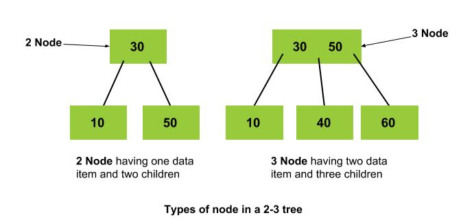

<iframe src="https://www.youtube.com/embed/acwLDUYG3ik" frameborder="0" allow="autoplay; encrypted-media" allowfullscreen></iframe>

### Definition

2–3 tree is a perfectly balanced binary search tree. It is called a 2-3 tree because each internal node has either 2 or 3 children. In 2-3 tree, every path from root to leaf has the same length and the data structure guarantees worst case O(log n) time complexity for search and insert operations.

### 2-3 Nodes

There are three types of nodes in a 2-3 tree

   - **2 Node:** An internal node is a 2-node if it has one data element and two children.
   - **3 Node:** An internal node is a 3-node if it has two data elements and three children.
   - **Leaf Node:** A leaf node contains only data elements and has no children.

### Pictorial Representation of 2-3 tree nodes 

### Properties of 2-3 tree

2-3 tree has the following properties:

  -  Every internal node is a 2-node or a 3-node.
  -  All leaves are at the same level.
   - All data is kept in sorted order. This means that:
      - In case of a 2 Node, data items in left subtree are smaller than root and data items in right subtree are greater than root.
      - In case of a 3 Node, data items in left subtree are smaller than root, data items in middle subtree are greater than root and data items in the right subtree are greater than the root and middle subtree.

### 2-3 Tree vs BST

  -  The main advantage with 2-3 trees is that it is balanced in nature as opposed to a binary search tree whose height in the worst case can be O(N).
  -  Due to this, the worst case time-complexity of operations such as search, insertion and deletion is O(Log(N)) as the height of a 2-3 tree is O(Log(N)).

