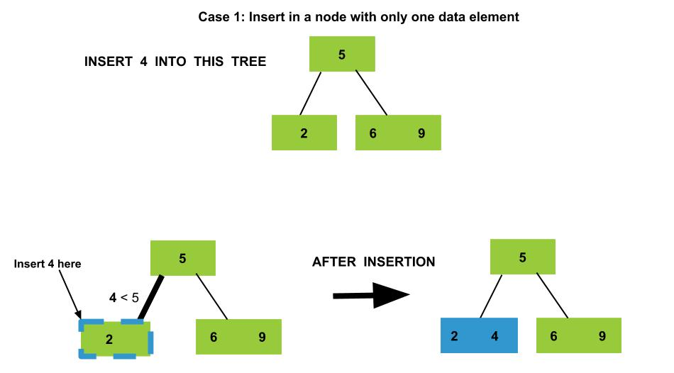
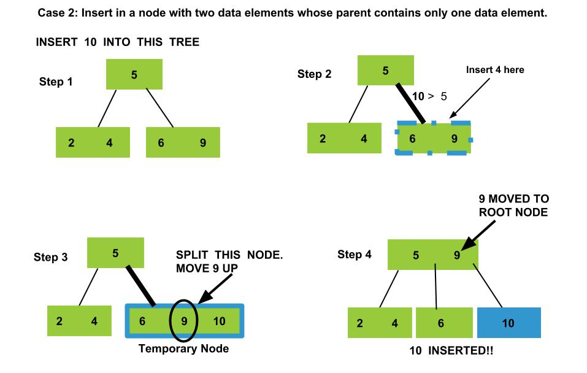
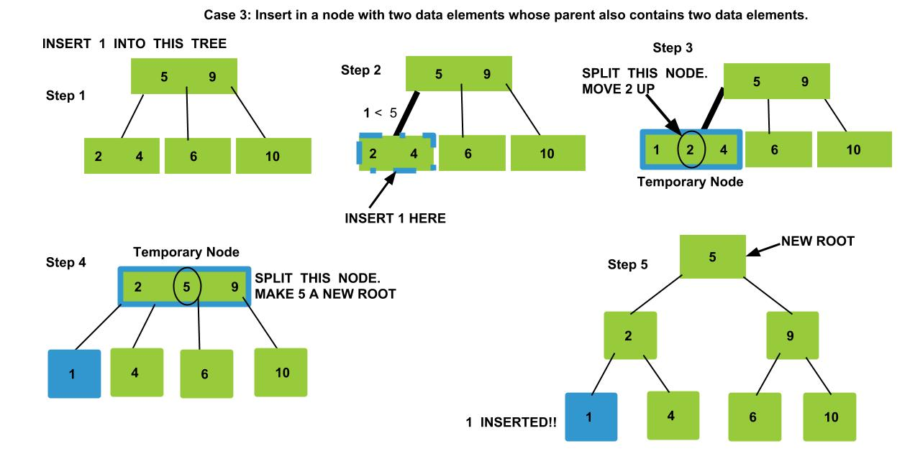

### 2-3 Insertion Video
<iframe src="https://www.youtube.com/embed/gcTu6d_HGSo" frameborder="0" allow="autoplay; encrypted-media" allowfullscreen></iframe>

### Intuition

Insertion in a 2-3 tree is very different from a Binary Search Tree as in a 2-3 tree, a node can have one data item (2-Node) or two data items (3-Node). At first, we search for the correct position of the new data element to be inserted into the tree. Once, we have found the postion of the new data element, one of the two conditions arise:

   - The data element is to be inserted as a new node. In this case, we simply create a new node and insert the data element.
   - In another case, the new data element is to be inserted in an already full node. Here, full node means a node which cannot accomodate any new element. This results in splitting of the node

### Insert in a node with only one data element

### Insert in a node with two data elements whose parent contains only one data element.

### Insert in a node with two data elements whose parent also contains two data elements.

### Algorithm

  -  If the tree is empty, create a new node and insert the data item. **Done**.
  - If the tree has only one node with one data element, insert the new element in this node. **Done**.
  -  Otherwise, search for the correct position of the new element.
  -  If the new element is to be inserted in a node with only one data element. Perform insert and we're **done**.
  -  If the new element is to be inserted in a node with two data elements and whose parent contains only one data element.
       - Insert the node in its correct position; this creates a **temporary node** with three data items.
       - Split the temporary node, by moving the medium element to the root. This results in creation of a 3-Node and we're done.
    If the new element is to be inserted in a node with two data elements and whose parent also contains two data elements.
       - Insert the node in its correct position, this creates a temporary node with three data items.
       - Move the median element to the parent node and split the current node into two nodes. Now, the **parent becomes a temporary node with three elements**.
       - Split the parent node by moving the median element one level up, this creates a new root of the current subtree and we're **done**.

