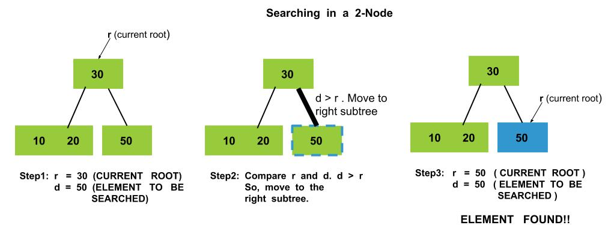
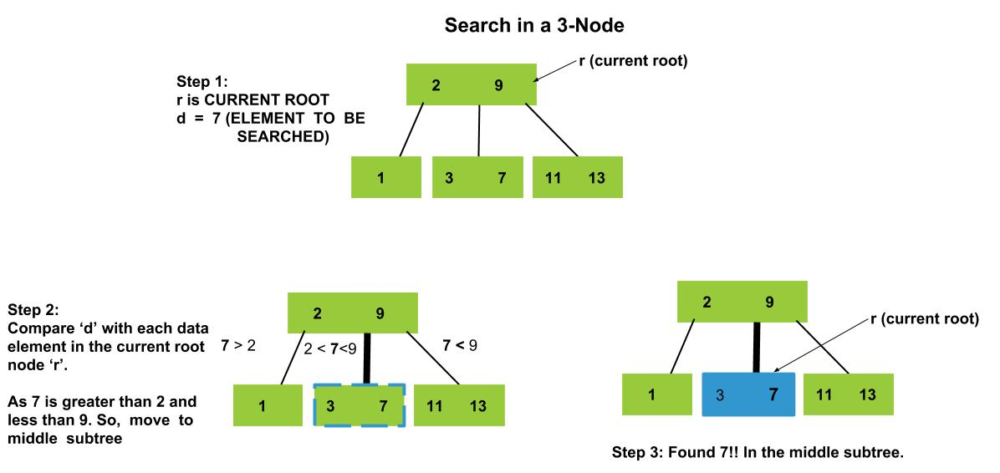

### 2-3 Search Video
<iframe src="https://www.youtube.com/embed/QrD1_ya1bJ0" frameborder="0" allow="autoplay; encrypted-media" allowfullscreen></iframe>

### Intuition

Searching for an item in a 2–3 tree is similar to searching for an item in a binary search tree. Since the data elements in each node are ordered, a search function will be directed to the correct subtree and eventually to the correct node which contains the item.

### Search in a 2-Node

### Search in a 3-Node

### Algorithm

   - 1. Let T be a 2–3 tree and **d** be the data element we want to find. If **T** is **empty**, then d is not in T and we're **done**.
   - 2. Let r be the root of T.
   - 3. Suppose r **is a leaf**.
       - **If d is not in r**, then d is not in T and we're **done**.
       - Otherwise, d is in T. In particular, d can be found at a leaf node. We need no further steps and we're done.
   - 4. Suppose **r is a 2-node** with left child L and right child R. Let e be the data element in r. There are three cases:
       - If **d = e**, then we've found d in T and we're **done**.
       - If **d < e**, then set T to L, which by definition is a 2–3 tree, and **go back to step 2**.
       - If **d > e**, then set T to R and **go back to step 2**.
   - 5. Suppose **r is a 3-node** with left child L, middle child M, and right child R. Let a and b be the two data elements of r, where a < b. There are four cases:
       - If **d is equal to a or b**, then d is in T and we're done.
       - If **d < a**, then set T to L and **go back to step 2**.
       - If **a < d < b**, then set T to M and **go back to step 2**.
       - If **d > b**, then set T to R and **go back to step 2**.

