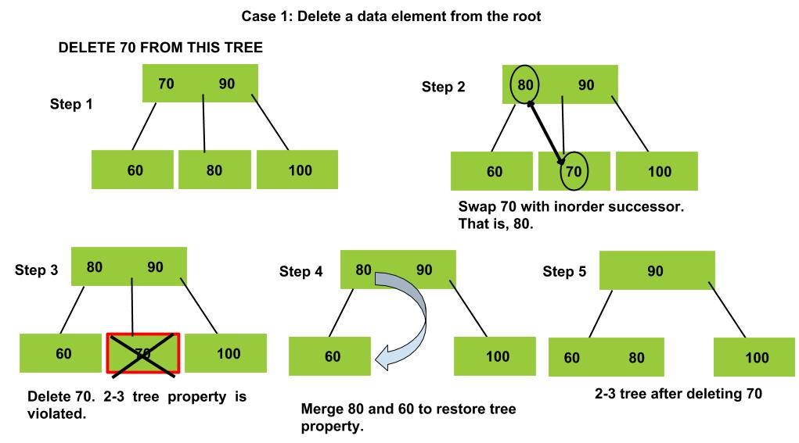
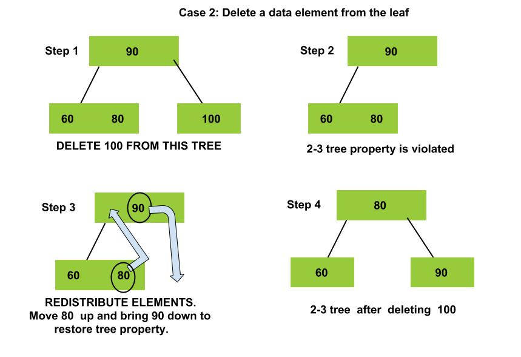

<iframe src="https://www.youtube.com/embed/t_LJ1Gh1AAw" frameborder="0" allow="autoplay; encrypted-media" allowfullscreen></iframe>

### Intuition

   - Deletion in a 2-3 is again different from that of a Binary Search tree. Recall that, in a 2-3 tree there are two types of nodes viz., 2-Node and 3-Node. When we delete a data element from the node of a 2-3 tree, it might lead to the property of the tree being violated.
  -  In order to maintain the property of a 2-3 tree even after deletion of a data element, we perform various operations such as merge, split and redistribution of elements in the tree.

### Delete a data element from an internal node.

### Delete a data element from leaf node.

### Algorithm

  -  If the data element to be deleted in the only element in the tree. Delete the node and we're done.
  -  If the data element to be deleted is a present in the leaf. Then, delete the data element. However, this deletion will result in violation of the 2-3 tree property. To correct this, we perform redistribution and merging of elements in the node such that the property is preserved.
  -  If the data element to be deleted is present in an internal node. Then, replace this data element with the inorder successor of the element. Now, delete the element according to step 2.

